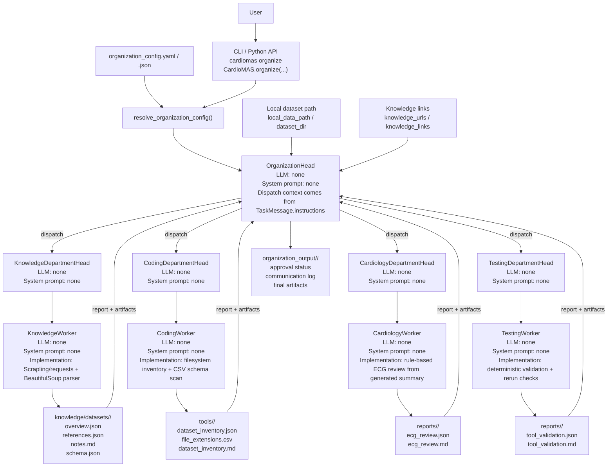

# Organization-Style System Structure

This document describes the new config-driven `cardiomas organize` workflow.

## Mermaid Diagram

## Runtime Flow

1. The user starts the workflow from CLI or Python.
2. Inputs can come directly from flags or from a YAML/JSON config file.
3. `resolve_organization_config()` merges config values and CLI overrides.
4. `OrganizationHead` coordinates all department communication.
5. Departments do not call each other directly; each returns artifacts to the `OrganizationHead`.
6. Final outputs are written under `organization_output/`.

## LLM / Prompt Status

The current `cardiomas organize` implementation is not LLM-backed. All current department heads and workers are deterministic Python components, so:

- LLM name: none
- System prompt: none

The closest prompt-like input in this path is the `TaskMessage.instructions` text created by `OrganizationHead`, but that text is routed to Python workers, not to an LLM.

## Where LLM Prompts Exist Today

LLM-backed agents currently exist in the separate `cardiomas analyze` pipeline, not in the new `organize` workflow.

- Default local LLM for that path: Ollama model from `OLLAMA_MODEL`, default `gemma4:e2b`
- Agent-specific overrides: `AGENT_LLM_<AGENT>` or runtime overrides
- System prompts: loaded from `src/cardiomas/skills/*.md`

Examples:

- `orchestrator` prompt: [src/cardiomas/skills/orchestrator.md](/work/vajira/DL2026/CardioMAS/src/cardiomas/skills/orchestrator.md)
- `discovery` prompt: [src/cardiomas/skills/discovery.md](/work/vajira/DL2026/CardioMAS/src/cardiomas/skills/discovery.md)
- `analysis` prompt: [src/cardiomas/skills/data_analysis.md](/work/vajira/DL2026/CardioMAS/src/cardiomas/skills/data_analysis.md)
- `paper` prompt: [src/cardiomas/skills/paper_analysis.md](/work/vajira/DL2026/CardioMAS/src/cardiomas/skills/paper_analysis.md)
- `splitter` prompt: [src/cardiomas/skills/split_strategy.md](/work/vajira/DL2026/CardioMAS/src/cardiomas/skills/split_strategy.md)
- `security` prompt: [src/cardiomas/skills/security.md](/work/vajira/DL2026/CardioMAS/src/cardiomas/skills/security.md)
- `coder` prompt: [src/cardiomas/skills/coder.md](/work/vajira/DL2026/CardioMAS/src/cardiomas/skills/coder.md)
- `publisher` prompt: [src/cardiomas/skills/publishing.md](/work/vajira/DL2026/CardioMAS/src/cardiomas/skills/publishing.md)

## Current Department Responsibilities

- Knowledge Department: fetch and normalize dataset documentation and paper links.
- Coding Department: inspect the local dataset directory and generate reusable summaries.
- Cardiology Department: produce ECG quality and split recommendations.
- Testing Department: validate generated coding outputs and reproducibility checks.
