# CardioMAS — Cardio Multi-Agent System

[](https://github.com/vlbthambawita/CardioMAS/actions/workflows/ci.yml)
[](https://pypi.org/project/cardiomas/)
[](LICENSE)
[](https://huggingface.co/datasets/vlbthambawita/ECGBench)

A locally-runnable multi-agent system for ECG datasets. The repository currently supports two execution styles:

- `cardiomas analyze`: the existing LangGraph pipeline for reproducible train/validation/test split generation.
- `cardiomas organize`: the newer organization-style workflow with an `OrganizationHead` coordinating Knowledge, Coding, Cardiology, and Testing departments.

Outputs are saved locally by default. Publishing to [vlbthambawita/ECGBench](https://huggingface.co/datasets/vlbthambawita/ECGBench) on HuggingFace is an explicit opt-in step that requires write access.

## Architecture

```mermaid
flowchart TD
    CLI(["`**CLI / Python API**
    cardiomas analyze`"])
    CLI --> ORCH

    subgraph PIPELINE ["LangGraph Pipeline — V2 Hub-and-Spoke"]
        ORCH(["🎯 **Orchestrator**
        Dynamic routing hub
        sets next_agent each turn"])

        %% Worker agents (spokes)
        NL["📝 NL Requirement
        Parse natural-language
        user requirements"]

        DISC["🔍 Discovery
        Identify dataset type,
        source & metadata"]

        PAPER["📄 Paper
        Find & parse paper
        Extract split methodology"]

        ANALYSIS["📊 Analysis
        Scan files, parse CSV
        Compute statistics"]

        SPLIT["✂️ Splitter
        SHA-256 seeded
        deterministic splits"]

        SEC["🔒 Security
        PII scan · raw-data
        Patient leakage check"]

        CODER["💻 Coder
        Generate custom
        split code"]

        PUB["☁️ Publisher
        Push to HF
        Update GitHub README"]

        %% Orchestrator → workers (dispatch)
        ORCH -->|dispatch| NL
        ORCH -->|dispatch| DISC
        ORCH -->|dispatch| PAPER
        ORCH -->|dispatch| ANALYSIS
        ORCH -->|dispatch| SPLIT
        ORCH -->|dispatch| SEC
        ORCH -->|dispatch| CODER
        ORCH -->|dispatch| PUB

        %% Workers → Orchestrator (return)
        NL -->|done| ORCH
        DISC -->|done| ORCH
        PAPER -->|done| ORCH
        ANALYSIS -->|done| ORCH
        SPLIT -->|done| ORCH
        SEC -->|done| ORCH
        CODER -->|done| ORCH
        PUB -->|done| ORCH

        %% Terminal routes from orchestrator
        ORCH -->|cache hit| EXISTING["↩ Return existing\nsplits from HF"]
        ORCH -->|audit failed| ERR["❌ End with error\nBlocked — not saved"]
        ORCH -->|pipeline done| SAVED["💾 End — saved locally"]
    end

    PUB -.->|if --push| HF[("HuggingFace
    vlbthambawita/ECGBench")]
    SAVED --> OUT

    OUT["`**output/&lt;dataset&gt;/**
    splits.json
    split_metadata.json
    analysis_report.md`"]

    style PIPELINE fill:#1a1a2e,stroke:#4a9eff,color:#fff
    style ORCH fill:#0f3460,stroke:#4a9eff,color:#fff,shape:stadium
    style NL fill:#2d1b4e,stroke:#9b59b6,color:#fff
    style DISC fill:#1b4332,stroke:#40916c,color:#fff
    style PAPER fill:#3b1f5e,stroke:#9b59b6,color:#fff
    style ANALYSIS fill:#7b4220,stroke:#e67e22,color:#fff
    style SPLIT fill:#1a5276,stroke:#2e86c1,color:#fff
    style SEC fill:#641e16,stroke:#e74c3c,color:#fff
    style CODER fill:#1a3a4a,stroke:#00bcd4,color:#fff
    style PUB fill:#145a32,stroke:#27ae60,color:#fff
    style SAVED fill:#1a3a1a,stroke:#27ae60,color:#fff
    style ERR fill:#3b0f0f,stroke:#e74c3c,color:#fff
    style HF fill:#2d2d2d,stroke:#f5a623,color:#fff
    style OUT fill:#2d2d2d,stroke:#4a9eff,color:#fff
    style EXISTING fill:#2d2d2d,stroke:#4a9eff,color:#fff
    style CLI fill:#0d0d0d,stroke:#4a9eff,color:#fff
```



Each node is a dedicated LLM-backed agent. The **orchestrator** is the central hub — it dynamically decides which agent to invoke next after each agent completes (hub-and-spoke pattern). Every worker agent returns to the orchestrator after finishing. Agents communicate only through the shared `GraphState`. The security agent is a hard gate — publishing is blocked if any check fails.

## Requirements

- Python ≥ 3.10
- [Ollama](https://ollama.com/) running locally with a model pulled (default: `gemma4:e2b`) for `cardiomas analyze`

```bash
# Local development install
pip install -e ".[dev]"

# Optional: richer browser-backed fetching for the Knowledge Department
scrapling install

# Required only for the LangGraph / LLM pipeline
ollama pull gemma4:e2b
ollama serve
```

## Quick Start

```bash
# Analyze a dataset — results saved to ./output/ptb-xl/
cardiomas analyze https://physionet.org/content/ptb-xl/1.0.3/

# Use a local directory
cardiomas analyze /data/ptb-xl/

# Stream all agent reasoning live
cardiomas analyze /data/ptb-xl/ --verbose

# Analyze and push to HuggingFace in one step (requires HF_TOKEN)
cardiomas analyze /data/ptb-xl/ --push
```

## Organizational Workflow

The repository also includes an organizational-style workflow that routes all work through an `OrganizationHead` and four departments:

- Knowledge Department: fetches and normalizes dataset knowledge from provided URLs.
- Coding Department: inspects a local dataset directory and writes reusable analysis artifacts.
- Cardiology Department: emits ECG-specific quality and split recommendations.
- Testing Department: validates generated coding outputs and writes structured reports.

This flow is additive to the existing LangGraph pipeline and is designed for inspectable artifact generation. The current `organize` path does not require Ollama.

### How To Run The New Structure

1. Install the repository in editable mode:

```bash
pip install -e ".[dev]"
```

2. Optionally install Scrapling browser support for richer page fetching:

```bash
scrapling install
```

3. Run the example workflow on the included tiny dataset:

```bash
cardiomas organize --config examples/tiny_ecg_dataset/organization_config.yaml
```

or pass values directly:

```bash
cardiomas organize examples/tiny_ecg_dataset \
  --dataset-name tiny-ecg-demo \
  --knowledge-url https://example.org/dataset-card
```

4. Review the generated artifacts under `organization_output/`. If you want the Organization Head to mark the major artifacts as approved, re-run with `--approve`:

```bash
cardiomas organize examples/tiny_ecg_dataset \
  --dataset-name tiny-ecg-demo \
  --knowledge-url https://example.org/dataset-card \
  --approve
```

By default this writes a department-oriented artifact tree:

```text
organization_output/
  knowledge/datasets/<dataset_name>/
    overview.json
    references.json
    notes.md
    schema.json
  tools/<dataset_name>/
    dataset_inventory.json
    file_extensions.csv
    dataset_inventory.md
  reports/<dataset_name>/
    ecg_review.json
    ecg_review.md
    tool_validation.json
    tool_validation.md
```

You can repeat `--knowledge-url` multiple times to provide a dataset landing page, paper URL, and documentation pages in the same run:

```bash
cardiomas organize /data/my-ecg-dataset \
  --dataset-name my-ecg-dataset \
  --knowledge-url https://dataset-homepage.example \
  --knowledge-url https://paper.example \
  --knowledge-url https://docs.example
```

You can also drive the entire workflow from a YAML or JSON config file. Example:

```yaml
dataset_name: ptb-xl
local_data_path: /data/ptb-xl
knowledge_urls:
  - https://physionet.org/content/ptb-xl/1.0.3/
  - https://example.org/ptb-xl-paper
goal: Prepare reusable dataset understanding artifacts
output_dir: organization_output/ptb-xl
approve: true
```

Supported config keys:

- `local_data_path` or `dataset_dir`: local dataset directory
- `dataset_name`: output dataset name
- `knowledge_urls` or `knowledge_links`: one or more documentation/paper URLs
- `goal`: high-level organization objective
- `output_dir`: artifact root directory
- `approve`: mark final artifacts as approved

Relative paths in the config file are resolved relative to the config file location.

Run it with:

```bash
cardiomas organize --config /path/to/organization.yaml
```

CLI values can still override the config file. For example, this reuses the same config but changes the dataset path:

```bash
cardiomas organize /data/ptb-xl-copy --config /path/to/organization.yaml
```

You can also run the same workflow from Python:

```python
from cardiomas import CardioMAS

cm = CardioMAS()
result = cm.organize(
    config_path="examples/tiny_ecg_dataset/organization_config.yaml",
)
print(result["status"])
```

After `analyze`, the following files are written locally:

```
output/
└── ptb-xl/
    ├── splits.json           # train/val/test record IDs + reproducibility config
    ├── split_metadata.json   # seed, strategy, version, timestamp
    └── analysis_report.md    # LLM-generated dataset analysis
```

## CLI Reference

### `cardiomas analyze`

Analyze a dataset and save splits locally.

```
cardiomas analyze DATASET_SOURCE [OPTIONS]
```

| Option | Default | Description |
|---|---|---|
| `--local-path PATH` | | Explicit local data path (skips download) |
| `--output-dir PATH` | `output` | Where to save results |
| `--seed INT` | `42` | Reproducibility seed |
| `--custom-split SPEC` | | e.g. `train:0.7,val:0.15,test:0.15` |
| `--stratify-by FIELD` | | Metadata field to stratify splits by |
| `--ignore-official` | | Ignore official splits, generate fresh |
| `--push` | | Also push to HuggingFace (requires `HF_TOKEN`) |
| `--force-reanalysis` | | Re-run even if already analyzed |
| `--use-cloud-llm` | | Use cloud LLM instead of local Ollama |
| `--verbose` / `-v` | | Stream agent reasoning and LLM calls live |
| `--json` | | Machine-readable JSON output |

#### Verbose output

`--verbose` (`-v`) prints every agent step and LLM prompt/response in real time instead of showing a spinner:

```bash
cardiomas analyze /data/ptb-xl/ -v
```

```
Verbose mode on — streaming agent output below.

  [orchestrator] pipeline start — source: /data/ptb-xl/
  [orchestrator] no cache hit — running full pipeline
  [discovery]    registry hit → ptb-xl
  [paper]        searching arXiv: 'ptb-xl ECG dataset electrocardiogram'
  [paper]        found 3 result(s)
  [paper]        calling LLM (ChatOllama)…
──────────────── paper — LLM call ────────────────
╭─ prompt ────────────────────────────────────────╮
│ Analyze this ECG dataset paper and extract: …  │
╰─────────────────────────────────────────────────╯
╭─ response ──────────────────────────────────────╮
│ 1. Official splits: Yes (Section 2.3, page 4)  │
╰─────────────────────────────────────────────────╯
  [analysis]     found 42 files
  [splitter]     saved splits → output/ptb-xl/splits.json
  [security]     audit PASSED — no PII, no raw data, no leakage
```

Each agent is color-coded. Without `--verbose`, only a spinner runs during the pipeline and a summary table is shown at the end.

### `cardiomas organize`

Run the organization-style workflow on a local dataset directory.

```bash
cardiomas organize DATASET_DIR [OPTIONS]
```

| Option | Default | Description |
|---|---|---|
| `--dataset-name TEXT` | folder name | Override the dataset name used in output paths |
| `--config`, `-c` PATH | | YAML or JSON config file with dataset path, links, and run settings |
| `--goal TEXT` | `Build reusable dataset knowledge and analysis artifacts` | High-level goal tracked by the Organization Head |
| `--knowledge-url TEXT` | | Repeat to provide landing pages, paper links, or docs |
| `--output-dir PATH` | `organization_output` | Root directory for knowledge, tool, and report artifacts |
| `--approve` | | Mark major artifacts as approved in the final organization report |
| `--json` | | Machine-readable JSON output |

Example:

```bash
cardiomas organize --config examples/tiny_ecg_dataset/organization_config.yaml
```

### `cardiomas push`

Push previously saved local splits to HuggingFace. Requires `HF_TOKEN`.

```bash
cardiomas push ptb-xl
cardiomas push ptb-xl --output-dir /my/results
```

Runs a security audit before uploading. Refuses to push if any check fails.

### `cardiomas status`

Check if a dataset has published splits on HuggingFace.

```bash
cardiomas status ptb-xl
```

### `cardiomas list`

```bash
cardiomas list              # show known datasets (registry)
cardiomas list --remote     # show datasets published on HuggingFace
cardiomas list --local      # show locally cached datasets
```

### `cardiomas verify`

Re-check reproducibility metadata of published splits.

```bash
cardiomas verify ptb-xl --seed 42
```

### `cardiomas contribute`

Submit community splits to `vlbthambawita/ECGBench`.

```bash
cardiomas contribute ptb-xl --split-file my_splits.json
```

### `cardiomas config`

```bash
cardiomas config --show
cardiomas config --set OLLAMA_MODEL=mistral
```

## HuggingFace Publishing (opt-in)

Publishing requires write access to `vlbthambawita/ECGBench`. Set your token before pushing:

```bash
export HF_TOKEN=hf_...
cardiomas push ptb-xl
```

Only record identifiers are ever published — no raw ECG signals, no patient data.

## Python API

```python
from cardiomas import CardioMAS

mas = CardioMAS(ollama_model="gemma4:e2b", seed=42)

# Analyze and save locally
result = mas.analyze("/data/ptb-xl/")
print(result["local_output_dir"])   # output/ptb-xl

# Analyze and push to HuggingFace
mas.analyze("/data/ptb-xl/", push_to_hf=True)

# Read back published splits
splits = mas.get_splits("ptb-xl")
train_ids = splits["train"]

# Custom splits
mas.analyze(
    "/data/ptb-xl/",
    custom_split={"train": 0.7, "val": 0.15, "test": 0.15},
    stratify_by="scp_codes",
    seed=123,
)
```

## Using Different Local Models

Any model available in Ollama works. Pull a model, then point CardioMAS at it:

```bash
# Default (recommended for full pipeline)
ollama pull gemma4:e2b

# Larger Gemma 4 variants for heavier reasoning tasks
ollama pull gemma4:e4b
ollama pull gemma4:27b

# DeepSeek Coder — best for the coding agent
ollama pull deepseek-coder:6.7b

# Use a specific model for the whole pipeline
OLLAMA_MODEL=gemma4:e2b cardiomas analyze /data/ptb-xl/

# Or set it permanently in .env
echo "OLLAMA_MODEL=gemma4:e2b" >> .env
```

## Per-Agent LLM Configuration

> **Available in v0.2.0 (dev/v2-dynamic-orchestrator)**

Each agent can use a different LLM. This is useful when you want a fast, lightweight model for simple tasks (discovery, security scan) and a more capable model for reasoning-heavy tasks (analysis, coding).

### Via environment variables

```bash
# Fallback for all agents
OLLAMA_MODEL=gemma4:e2b

# Per-agent overrides (all optional)
AGENT_LLM_ORCHESTRATOR=gemma4:e2b
AGENT_LLM_NL_REQUIREMENT=gemma4:e2b
AGENT_LLM_DISCOVERY=gemma4:e2b
AGENT_LLM_PAPER=gemma4:e2b
AGENT_LLM_ANALYSIS=gemma4:e2b
AGENT_LLM_SPLITTER=gemma4:e2b
AGENT_LLM_SECURITY=gemma4:e2b
AGENT_LLM_CODER=deepseek-coder:6.7b
AGENT_LLM_PUBLISHER=gemma4:e2b
```

Set these in `.env` or export them before running `cardiomas`.

### Via CLI flags

```bash
cardiomas analyze /data/ptb-xl/ \
  --llm-coder deepseek-coder:6.7b \
  --llm-analysis gemma4:e4b \
  --llm-discovery gemma4:e2b
```

### Via Python API

```python
from cardiomas import CardioMAS

mas = CardioMAS(
    agent_llms={
        "coder":    "deepseek-coder:6.7b",
        "analysis": "gemma4:e4b",
        "default":  "gemma4:e2b",   # fallback for all other agents
    }
)
mas.analyze("/data/ptb-xl/")
```

### Model recommendations

| Agent | Recommended model | Why |
|---|---|---|
| `orchestrator` | `gemma4:e2b` | Default — dynamic routing decisions |
| `nl_requirement` | `gemma4:e2b` | Simple parsing task |
| `discovery` | `gemma4:e2b` | Lookup + classification |
| `paper` | `gemma4:e2b` or `gemma4:e4b` | Needs to read and summarise papers |
| `analysis` | `gemma4:e2b` or `gemma4:e4b` | Statistical reasoning |
| `splitter` | `gemma4:e2b` | Deterministic — LLM role is minimal |
| `security` | `gemma4:e2b` | Pattern matching |
| `coder` | `deepseek-coder:6.7b` | Code generation |
| `publisher` | `gemma4:e2b` | Structured output |

### Verbose LLM name display

With `--verbose`, each LLM call shows the model name and backend:

```
──────────── paper — LLM call [gemma4:e2b @ ollama] ────────────
```

## Environment Variables

Copy `.env.example` to `.env` and fill in as needed.

| Variable | Required for | Default |
|---|---|---|
| `OLLAMA_MODEL` | local LLM (default for all agents) | `gemma4:e2b` |
| `OLLAMA_BASE_URL` | local LLM | `http://localhost:11434` |
| `AGENT_LLM_<AGENT>` | per-agent model override | *(falls back to `OLLAMA_MODEL`)* |
| `HF_TOKEN` | `--push` / `cardiomas push` | — |
| `GITHUB_TOKEN` | GitHub README auto-update | — |
| `CARDIOMAS_SEED` | reproducibility | `42` |
| `CLOUD_LLM_PROVIDER` | `--use-cloud-llm` | `none` |

## Links

- **HuggingFace Dataset**: [vlbthambawita/ECGBench](https://huggingface.co/datasets/vlbthambawita/ECGBench)
- **PyPI**: [cardiomas](https://pypi.org/project/cardiomas/)
- **GitHub**: [vlbthambawita/CardioMAS](https://github.com/vlbthambawita/CardioMAS)

<!-- DATASETS TABLE -->
