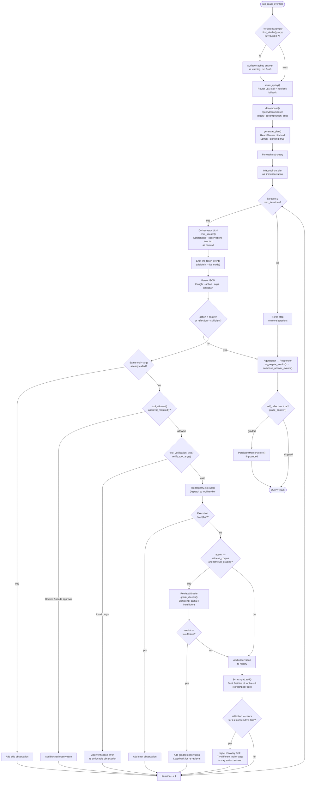
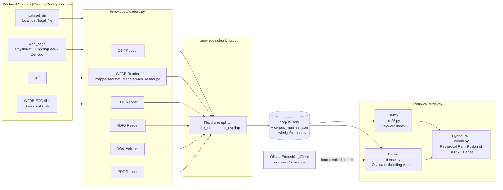

# CardioMAS System Architecture

CardioMAS is an Agentic RAG runtime for grounded Q&A over ECG and medical datasets. A `RuntimeConfig` (YAML/JSON) declares knowledge sources, retrieval settings, and agent behaviour. At query time the system builds a local corpus, registers tools, and routes the query through either the ReAct loop or the legacy linear pipeline.

---

## 1. System Overview

```mermaid
flowchart TD
    %% ── User Interfaces ──────────────────────────────────────────────────────
    subgraph UI["User Interfaces"]
        CLI["CLI\ncli/main.py\ncardiomas query --live --json"]
        PYAPI["Python API\nCardioMAS / api.py"]
    end

    %% ── Configuration ────────────────────────────────────────────────────────
    subgraph CFG["RuntimeConfig  schemas/config.py"]
        direction LR
        AGCFG["AgentConfig\nmode · max_iterations\nupfront_planning · step_reflection\nscratchpad · tool_verification"]
        ACFG["AutonomyConfig\nenable_code_agents\ndataset_mode · execute_for_answer"]
        LCFG["LLMConfig\nmodel · temperature · max_tokens"]
        RCFG["RetrievalConfig\nmode · top_k · chunk_size"]
    end

    %% ── Runtime ──────────────────────────────────────────────────────────────
    RT["AgenticRuntime\nagentic/runtime.py"]

    %% ── ReAct Pipeline ───────────────────────────────────────────────────────
    subgraph REACT["ReAct Pipeline   agent.mode: react   agentic/react_agent.py"]
        direction TB
        ROUTER["Router\nagentic/router.py\nClassifies: code | retrieval | web | orchestrate\nLLM call with keyword heuristic fallback"]
        DECOMP["QueryDecomposer\nagentic/query_decomposer.py\nSplits complex queries into ≤ 4 sub-queries\nfactual · computational · exploratory"]
        RPLAN["ReactPlanner\nagentic/react_planner.py\nOne LLM call → ordered 2-5 tool sequence\nSoft guide for the loop  (upfront_planning)"]

        subgraph LOOP["_react_loop()   up to max_iterations"]
            direction TB
            ORCLLM["Orchestrator LLM\nchat_stream() — live token feed\nOutputs JSON: thought + action + args + reflection"]
            PRECHECK["PreExecVerifier\ntools/pre_exec_verifier.py\nPath exists? Task non-empty?\n(tool_verification)"]
            SFTY["Safety Gate\nsafety/permissions.py · safety/approvals.py\ntool_allowed() · approval_required()"]
            REGEXEC["ToolRegistry.execute()\ntools/registry.py\n**kwargs normalisation"]
            RGRADER["RetrievalGrader\nagentic/retrieval_grader.py\nSufficient | partial | insufficient\n(retrieval_grading)"]
            SCRATCH["Scratchpad\nmemory/scratchpad.py\nFirst-line distillation per tool call\nInjected as Running knowledge each iter\n(scratchpad)"]
        end

        AGRADE["AnswerGrader\nagentic/answer_grader.py\nGrounded | hallucinated | incomplete\n(self_reflection)"]
    end

    %% ── Linear Pipeline (legacy) ─────────────────────────────────────────────
    subgraph LINEAR["Linear Pipeline   agent.mode: linear  (legacy default)"]
        direction TB
        LPLAN["Planner\nagentic/planner.py\nHeuristic or Ollama-based\nOutputs AgentDecision with ordered steps"]
        LEXEC["Executor\nagentic/executor.py\nRuns each plan step via ToolRegistry"]
    end

    %% ── Shared Post-Processing ───────────────────────────────────────────────
    subgraph POST["Shared Post-Processing"]
        AGG["Aggregator\nagentic/aggregator.py\nMerges ToolResults → sorted EvidenceChunks\nSynthetic chunks from tool summaries (score 0.95)"]
        RESP["Responder\nagentic/responder.py\nchat_stream() → grounded JSON answer\nFallback to chat() if stream empty"]
    end

    %% ── Tools ────────────────────────────────────────────────────────────────
    subgraph TOOLS["Tools   tools/registry.py"]
        direction LR
        subgraph DSET["Dataset & Web Tools"]
            T1["list_folder_structure\ndataset_tools.py\nASCII tree + file sizes + CSV headers"]
            T2["inspect_dataset\ndataset_tools.py\nExtension counts, total files, schemas"]
            T3["read_wfdb_dataset\nwfdb_tools.py\nPhysioNet WFDB ECG records\n.hea / .dat / .atr  —  leads, sampling rate, duration"]
            T4["read_dataset_website\nweb_dataset_tools.py\nFetch PhysioNet · HuggingFace · Zenodo pages\nExtracts sections, tables, key_facts, links"]
        end
        subgraph ANALY["Analysis & Retrieval Tools"]
            T5["retrieve_corpus\nretrieval_tools.py\nRanked EvidenceChunk retrieval"]
            T6["calculate\nutility_tools.py\nSafe arithmetic evaluation"]
            T7["fetch_webpage\nresearch_tools.py\nRaw URL fetch  (allow_web_fetch: true)"]
        end
        subgraph CODEGEN["Code-Generation Tools"]
            T8["generate_python_artifact\ncoding/script_builder.py\nLLM writes Python, autonomy layer runs it"]
            T9["generate_shell_artifact\ncoding/script_builder.py\nLLM writes bash, autonomy layer runs it"]
        end
    end

    %% ── Knowledge & Retrieval ────────────────────────────────────────────────
    subgraph KNOWLEDGE["Knowledge & Retrieval"]
        direction TB
        subgraph SRCS["Declared Sources  (RuntimeConfig.sources)"]
            direction LR
            S1["dataset_dir / local_dir / local_file"]
            S2["web_page"]
            S3["pdf"]
        end
        LOAD["Loaders\nknowledge/loaders.py\nFormat-aware ingestion incl. WFDB, CSV, EDF, HDF5"]
        CHUNK["Chunker\nknowledge/chunking.py\nFixed-size with overlap"]
        CORPUS[("Corpus Store\nknowledge/corpus.py\ncorpus.jsonl + corpus_manifest.json")]
        subgraph RET["Retrieval Engines"]
            direction LR
            BM25["BM25\nretrieval/bm25.py"]
            DENSE["Dense\nretrieval/dense.py\nOllama embeddings"]
            HYBRID["Hybrid RRF\nretrieval/hybrid.py\nReciprocal Rank Fusion"]
        end
    end

    %% ── Autonomy Layer ───────────────────────────────────────────────────────
    subgraph AUTO["Autonomy Layer"]
        direction LR
        AUTOMAN["AutonomousToolManager\nautonomy/recovery.py\nRetry + repair loop, emits RepairTrace events"]
        CODER["LLMCoder\ncoding/llm_coder.py\nGenerates Python or shell code via LLM"]
        SBUILD["ScriptBuilder\ncoding/script_builder.py\nWrites, verifies, and optionally executes scripts"]
        VER["CodeVerifier\nautonomy/verifier.py\nSyntax + safety checks before execution"]
        WS["Workspace\nautonomy/workspace.py\nIsolated artifact directory"]
    end

    %% ── Inference ────────────────────────────────────────────────────────────
    subgraph INFRA["Infrastructure"]
        direction LR
        subgraph INF["Inference   inference/ollama.py"]
            CHAT["OllamaChatClient\n.chat() / .chat_stream()\nBase class default: wraps chat() as single-chunk stream"]
            EMBC["OllamaEmbeddingClient\n.embed()"]
        end
        subgraph MEM["Memory"]
            SESS["SessionStore\nmemory/session.py\nPer-query tool call history"]
            PMEM["PersistentMemory\nmemory/persistent.py\nFile-backed answer cache\nBag-of-words cosine similarity (threshold 0.70)"]
        end
    end

    QR(["QueryResult\nschemas/runtime.py\nanswer · citations · react_steps · tool_calls · warnings"])

    %% ── Connections ──────────────────────────────────────────────────────────

    CLI & PYAPI --> RT
    CFG --> RT

    RT -->|"mode: react"| ROUTER
    RT -->|"mode: linear"| LPLAN

    ROUTER --> DECOMP --> RPLAN --> ORCLLM
    PMEM -.->|"Similar past answer\n(persistent memory)"| ROUTER

    ORCLLM -->|"action + args"| PRECHECK
    PRECHECK -->|"valid"| SFTY
    SFTY -->|"allowed"| REGEXEC
    REGEXEC -->|"retrieve_corpus"| RGRADER
    RGRADER -->|"ok"| SCRATCH
    REGEXEC -->|"other tools"| SCRATCH
    SCRATCH -.->|"Running knowledge"| ORCLLM

    LPLAN --> LEXEC

    REGEXEC --> T1 & T2 & T3 & T4
    REGEXEC --> T5 & T6 & T7
    REGEXEC --> T8 & T9

    LOOP --> AGG
    LEXEC --> AGG
    AGG --> RESP --> AGRADE
    AGRADE --> QR
    AGRADE --> PMEM

    T5 --> HYBRID --> BM25 & DENSE --> CORPUS
    SRCS --> LOAD --> CHUNK --> CORPUS
    EMBC --> DENSE

    T8 & T9 --> AUTOMAN --> CODER --> SBUILD
    AUTOMAN --> VER & WS

    CHAT --> ORCLLM
    CHAT --> RESP
    CHAT --> ROUTER & RPLAN & LPLAN & CODER
    EMBC --> CORPUS
    LOOP --> SESS
```

---

## 2. ReAct Agent Loop — Detailed Control Flow

---

## 3. Knowledge Build Pipeline

---

## 4. Component Reference

### AgentConfig Flags

| Flag | Default | Description |
|---|---|---|
| `mode` | `linear` | `react` enables the ReAct loop; `linear` uses plan→execute |
| `max_iterations` | `5` | Maximum think-act-observe cycles per sub-query |
| `upfront_planning` | `false` | One LLM call before the loop generates an ordered tool sequence |
| `step_reflection` | `false` | Each orchestrator response includes a `reflection` field; `sufficient` stops early, 2× `stuck` injects a recovery hint |
| `scratchpad` | `true` | Distilled one-sentence key-facts accumulated and shown to the LLM each iteration |
| `tool_verification` | `true` | Pre-execution Python check: path exists, task non-empty |
| `query_decomposition` | `false` | Split complex queries into up to 4 atomic sub-queries |
| `retrieval_grading` | `true` | Grade retrieved chunks; loop back if verdict is `insufficient` |
| `self_reflection` | `false` | Grade the final answer for grounding / hallucination |
| `memory_mode` | `session` | `persistent` enables cross-session file-backed answer cache |

### AgentEvent Types (streaming)

| `type` | Emitted by | Description |
|---|---|---|
| `status` | All stages | Stage transitions, grader verdicts, summaries |
| `tool_started` / `tool_finished` | ReAct loop | Before/after each tool dispatch |
| `llm_stream_start` / `llm_token` / `llm_stream_end` | Orchestrator, Responder | Live token feed from Ollama |
| `repair_trace` | Autonomy layer | Retry/repair attempt details |
| `final_result` | Runtime | Contains the complete serialised `QueryResult` |

### Tool Inventory

| Tool | Module | Requires |
|---|---|---|
| `list_folder_structure` | `tools/dataset_tools.py` | `path` (dir) |
| `inspect_dataset` | `tools/dataset_tools.py` | `path` (dir) |
| `read_wfdb_dataset` | `tools/wfdb_tools.py` | `path` (dir with .hea files) |
| `read_dataset_website` | `tools/web_dataset_tools.py` | `url` or source label |
| `retrieve_corpus` | `tools/retrieval_tools.py` | Corpus built |
| `calculate` | `tools/utility_tools.py` | `expression` |
| `fetch_webpage` | `tools/research_tools.py` | `allow_web_fetch: true` |
| `generate_python_artifact` | `coding/script_builder.py` | `enable_code_agents: true` |
| `generate_shell_artifact` | `coding/script_builder.py` | `enable_code_agents: true` |
